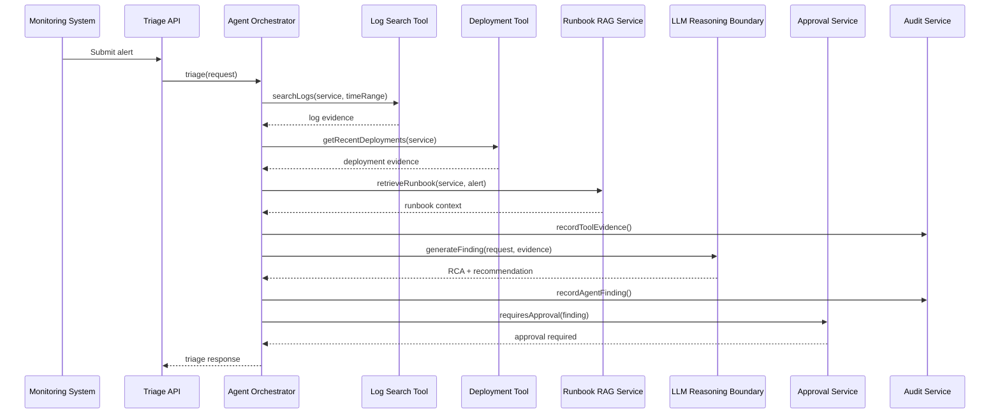

# Sequence Diagram

```mermaid
sequenceDiagram
    participant Alert as Monitoring System
    participant API as Triage API
    participant Agent as Agent Orchestrator
    participant Logs as Log Search Tool
    participant Deploy as Deployment Tool
    participant RAG as Runbook RAG Service
    participant LLM as LLM Reasoning Boundary
    participant Approval as Approval Service
    participant Audit as Audit Service

    Alert->>API: Submit alert
    API->>Agent: triage(request)
    Agent->>Logs: searchLogs(service, timeRange)
    Logs-->>Agent: log evidence
    Agent->>Deploy: getRecentDeployments(service)
    Deploy-->>Agent: deployment evidence
    Agent->>RAG: retrieveRunbook(service, alert)
    RAG-->>Agent: runbook context
    Agent->>Audit: recordToolEvidence()
    Agent->>LLM: generateFinding(request, evidence)
    LLM-->>Agent: RCA + recommendation
    Agent->>Audit: recordAgentFinding()
    Agent->>Approval: requiresApproval(finding)
    Approval-->>Agent: approval required
    Agent-->>API: triage response
```
